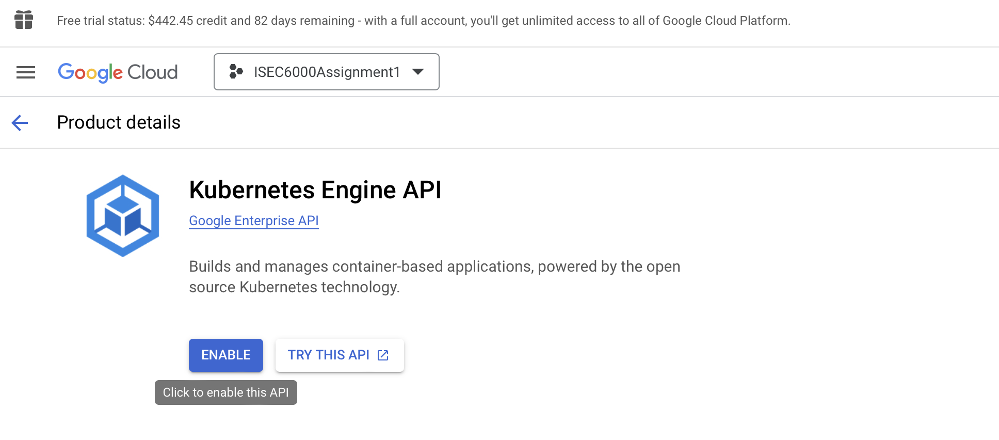
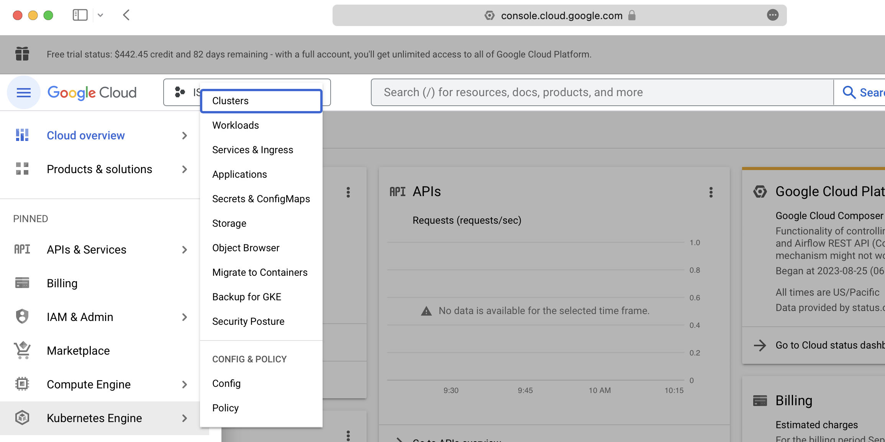
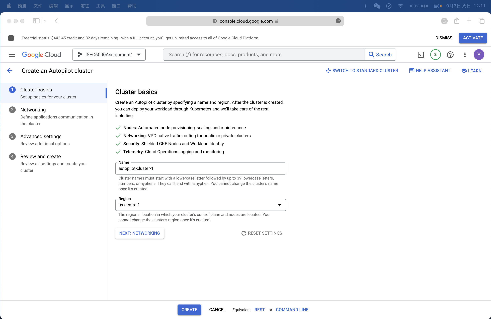
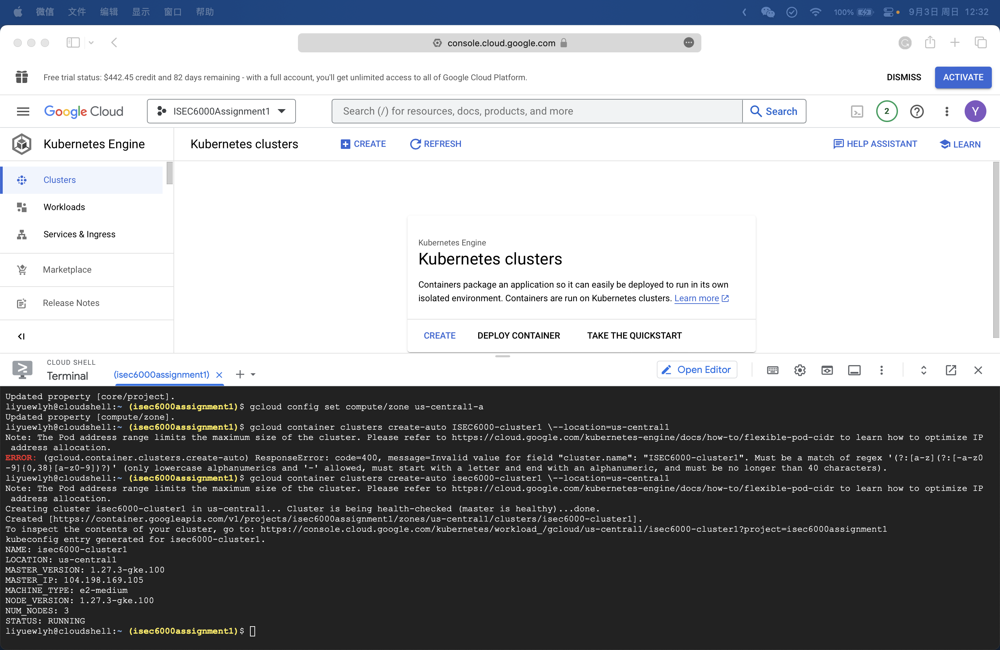
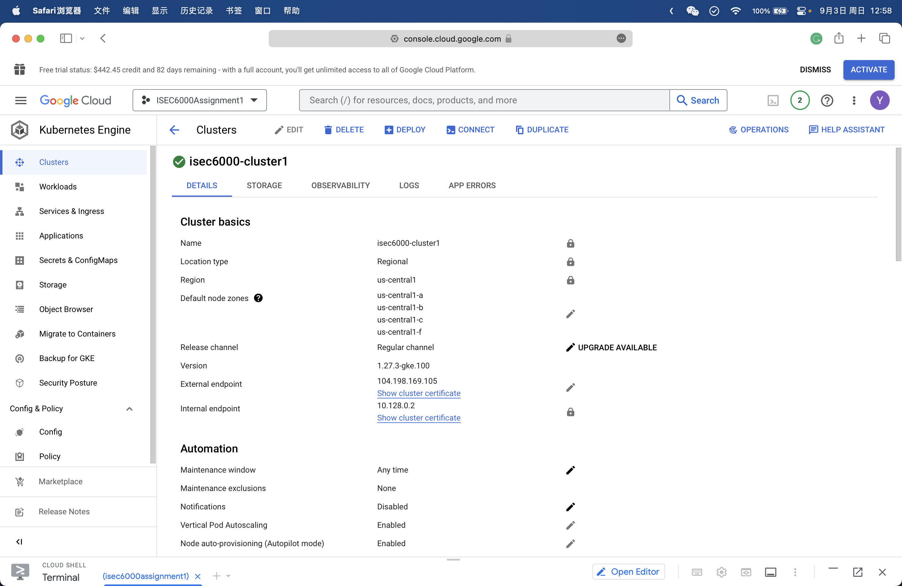
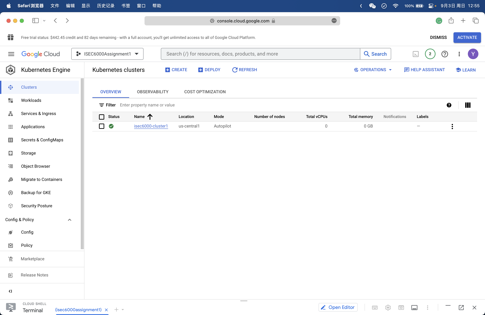
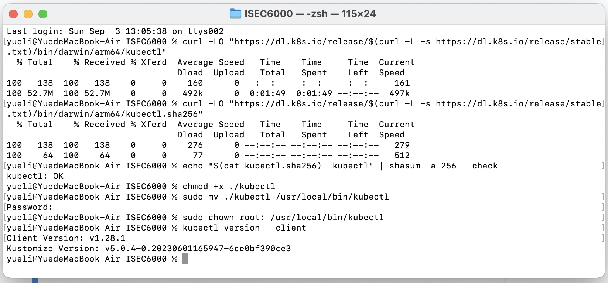
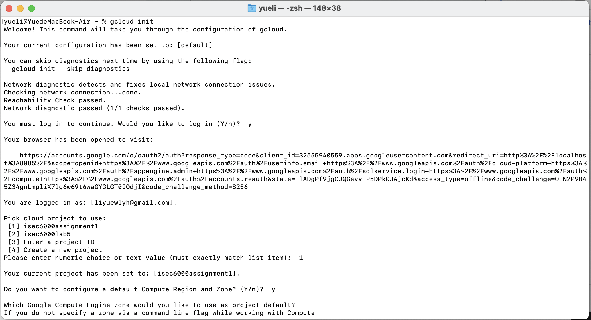
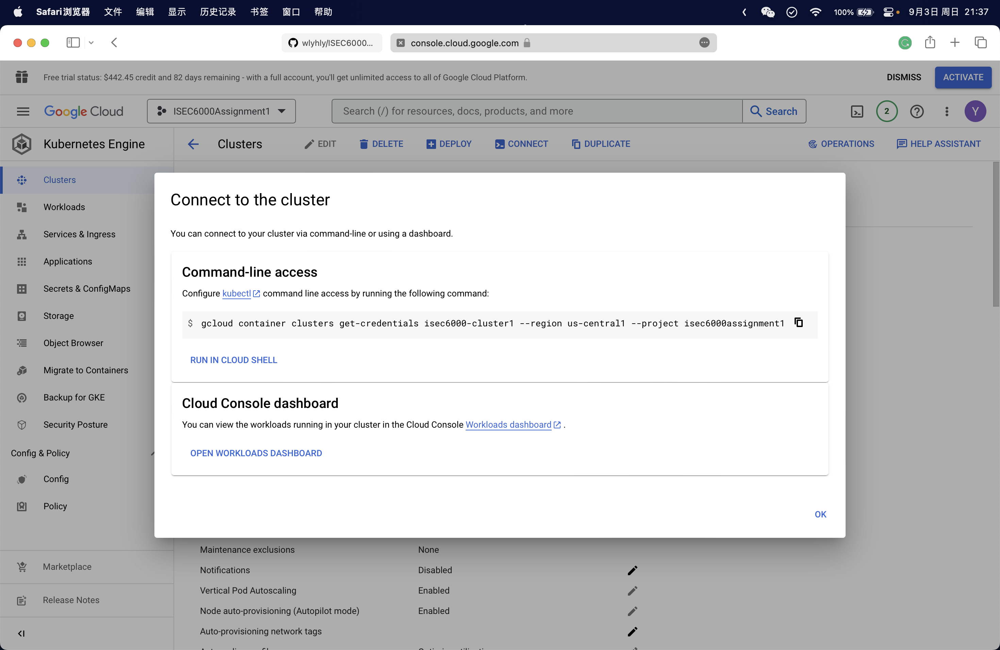
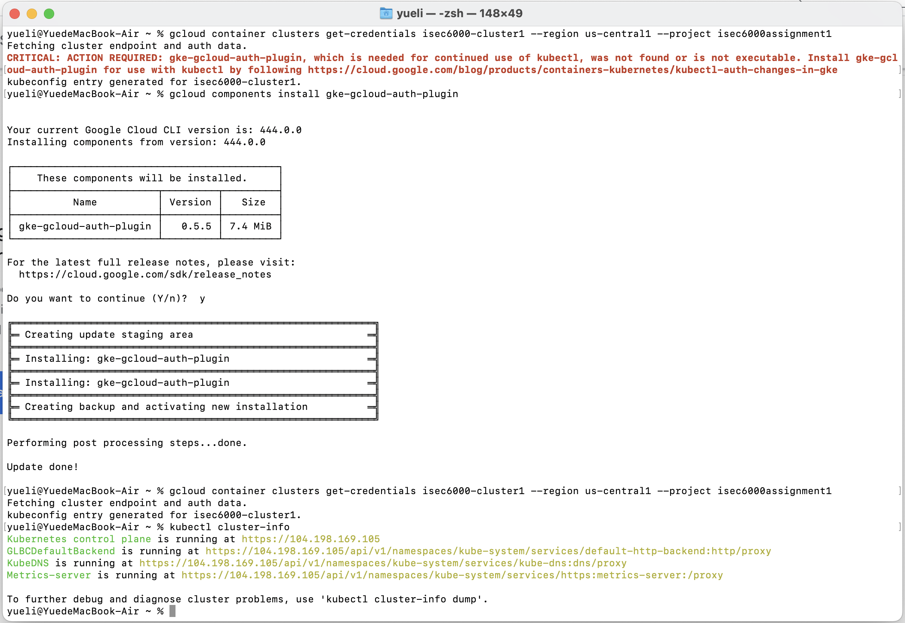

# ISEC6000_Assignment1_Task1
## This is the project task 1 of ISEC6000 Secure DevOps: Set Up Initial Infrastructure
### 1. Create a Kubernetes Cluster on GKE (or equivalent tool)
a. Log in to Google Cloud Console and create a new project

b. Enable the Kubernetes Engine API.


c. Create Cluster with two Choices:
1) Create Cluster by menu. 
   
   Navigate to the Kubernetes Engine section and click "Create Cluster." Configure your cluster settings, such as the cluster name, location, and node pool configuration step by step.
   
   

   


2) Create Cluster by Terminal.
   
    Click the Activate Cloud Shell button, and enter the following commands. You can also get the commands in the file 'Task1_Command':

    ```
    # set the project
    gcloud config set project isec6000assignment1 
    # set the compute zone
    gcloud config set compute/zone us-central1-a 
    # create a cluster named isec6000-cluster1
    gcloud container clusters create-auto isec6000-cluster1 --location=us-central1 
    # get authentication credentials for the cluster
    gcloud container clusters get-credentials isec6000-cluster1 --location us-central1
    ```

    This is the command:
    

   This is the cluster detail:
   

   This is the cluster overview:
   

### 2. Install and configure kubectl to manage your Kubernetes cluster.
a. Install Kubectl and configure local environment to use kubectl to interact with this cluster.
1) Following the instructions in the Kubernetes documentation to [install Kubectl](https://kubernetes.io/docs/tasks/tools/).
   

2) [Install the Google Cloud CLI](https://cloud.google.com/sdk/docs/install-sdk) 
   
   Following the instructions initialize the gcloud CLI and login and pick project to use.
   
   

3) [Kubectl authentication plugin installation instructions.](https://cloud.google.com/blog/products/containers-kubernetes/kubectl-auth-changes-in-gke) 
   
   You will need to install the gke-gcloud-auth-plugin binary on all systems where kubectl or Kubernetes custom clients are used. To install the binary, Run the following command:
   ```
   gcloud components install gke-gcloud-auth-plugin
   ```
   Note: It depends on you system. More details can see the Kubectl authentication plugin installation instructions.

4) Connect to the cluster. 
   
   Navigate to the "Kubernetes Engine" section and click on "Clusters." Find the cluster you created and click on its name to the details. Click the "Connect" button and you can see the commond-line access. Copy the commond-line and run in your local machine.

   

5) Verify the connection.
   
   Run the following command:
   ```
   kubectl cluster-info
   ```
   
